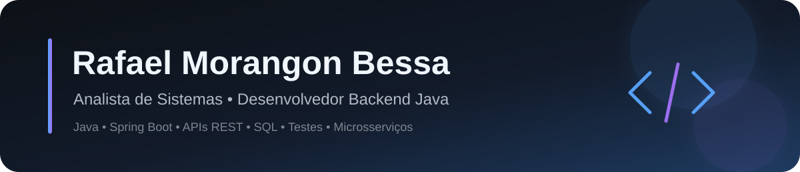

  

  <a href="https://rafael-bessa.github.io/"><strong>Portfólio</strong></a> •
  <a href="https://www.linkedin.com/in/rafaelmbessa"><strong>LinkedIn</strong></a> •
  <a href="https://www.youtube.com/@rafaelmbessa"><strong>YouTube</strong></a> •
  <a href="mailto:rafaelbessadev@gmail.com"><strong>E-mail</strong></a>

---

## Sobre mim

Sou formado em **Análise e Desenvolvimento de Sistemas** e concentro meus estudos e projetos em **backend Java** e análise de sistemas. Gosto de transformar regras de negócio em APIs e aplicações organizadas, testáveis e fáceis de evoluir.

Hoje meu foco está em **Java 17/21, Spring Boot, APIs REST, segurança, persistência, SQL, testes automatizados, Docker e arquitetura de microsserviços**.

- 🎓 **Tecnologia em Análise e Desenvolvimento de Sistemas — UNIP (2025)**
- ☕ Formação prática em Java desde 2019, incluindo **FJ-11 presencial**
- 📚 Formação complementar por **USP, ITA, IBM, Alura e Coursera**
- 📍 São Paulo, Brasil

> **Objetivo profissional:** atuar como **Analista de Sistemas** ou **Desenvolvedor Backend Java**, contribuindo com análise, desenvolvimento, qualidade e evolução de sistemas.

---

## Stack principal

  
  
  
  
  

  
  
  
  
  

  
  
  
  
  
  

<strong>Ver conhecimentos complementares</strong>

 

`Spring MVC` · `Spring Data JPA` · `Spring Cloud Gateway` · `Eureka` · `OpenFeign` · `Resilience4j` · `JWT` · `OpenAPI/Swagger` · `Maven` · `Gradle` · `Docker Compose` · `Zipkin` · `TypeScript` · `HTML5` · `CSS3` · `AWS (fundamentos)` · `Clean Code` · `SOLID`

---

## Projetos em destaque

| Projeto | O que demonstra | Stack principal |
| --- | --- | --- |
| **[TaskFlow](https://github.com/Rafael-Bessa/TaskFlow)** | Aplicação full stack com 12 endpoints REST, JWT stateless, paginação, validações, isolamento de tarefas por usuário e testes em múltiplas camadas. | Java 17, Spring Boot, Spring Security, JPA, Angular, SQL Server, JUnit, Mockito |
| **[E-commerce Microsserviços](https://github.com/Rafael-Bessa/ecommerce-microservices-spring)** | Arquitetura distribuída com Gateway, Service Discovery, comunicação síncrona e assíncrona, tolerância a falhas, cache e tracing. | Spring Cloud, Eureka, OpenFeign, Resilience4j, RabbitMQ, Redis, Docker Compose, Zipkin |
| **[API de Orçamento Familiar](https://github.com/Rafael-Bessa/family-budget-api)** | API REST com autenticação JWT, filtros, resumo mensal, documentação e execução containerizada. | Java 17, Spring Boot, Spring Security, MySQL, Swagger, JUnit, Docker Compose |
| **[Análise de Transações Financeiras](https://github.com/Rafael-Bessa/financial-fraud-detector)** | Processamento de CSV, regras de negócio para detecção de movimentações suspeitas, auditoria e testes de fluxo. | Java 17, Spring Boot, Spring Security, JPA, Thymeleaf, JUnit, Selenium |

  <a href="https://rafael-bessa.github.io/#projetos"><strong>→ Ver os projetos com mais detalhes no portfólio</strong></a>

---

## Formação & aprendizado contínuo

Minha formação técnica combina graduação, cursos estruturados e projetos práticos.

- **ADS — Universidade Paulista (UNIP)**, concluído em 2025
- **FJ-11 — Java e Orientação a Objetos**, formação presencial em 2019
- **USP / Coursera:** Introdução à Ciência da Computação com Python e Laboratório de Programação Orientada a Objetos
- **ITA / Coursera:** Orientação a Objetos com Java e Desenvolvimento Ágil com Java Avançado
- **IBM / Coursera:** Introduction to Software Engineering
- **Alura:** trilhas e cursos em Java, Spring, AWS, bancos de dados e Engenharia de Software

  <a href="https://rafael-bessa.github.io/#aprendizado"><strong>→ Ver cursos, formações e certificados</strong></a>

---

## Conteúdo técnico

Também uso o YouTube como espaço de aprendizado público e comunicação técnica.

  

  <a href="https://www.youtube.com/@rafaelmbessa"><strong>▶ Ver mais vídeos no canal</strong></a>

---

## Contato

Se quiser conversar sobre uma oportunidade, projeto ou tecnologia:

  <strong><a href="mailto:rafaelbessadev@gmail.com">E-mail</a></strong> •
  <strong><a href="https://www.linkedin.com/in/rafaelmbessa">LinkedIn</a></strong> •
  <strong><a href="https://rafael-bessa.github.io/">Portfólio</a></strong> •
  <strong><a href="https://www.youtube.com/@rafaelmbessa">YouTube</a></strong>

